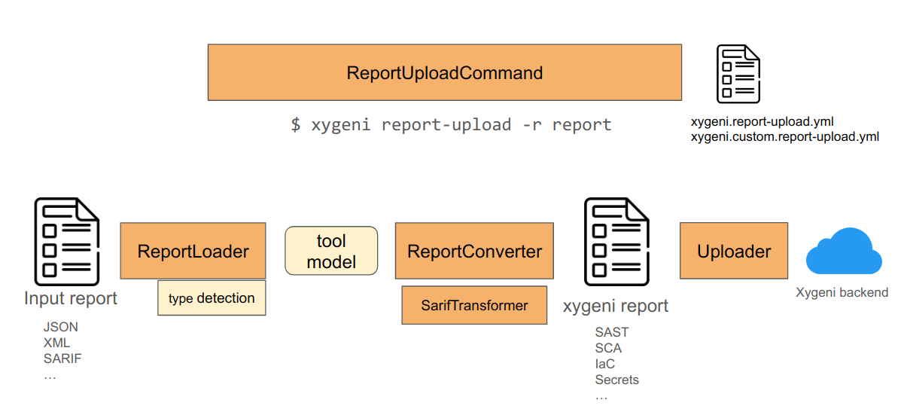

# Report Upload

Table of Contents

- [About](#about)
- [The Report Upload framework](#the-report-upload-framework)
- [Adding support for a new format](#adding-support-for-a-new-report-format)
- [Formats](#formats)
  - [Secrets](#secrets)
  - [SAST](#sast)
  - [SCA](#sca)
  - [IaC](#iac)

## About

Xygeni prioritization and response can be also used with security findings reported by third-party security tools (namely external scanners), both open-source and commercial. The scanner provides a report-upload command for uploading the structured reports generated by third-party security tools, in areas like Static Application Security Testing (SAST), Software Composition Analysis (SCA), or Secret Leaks / IaC Flaws Detection.

Imagine that your organization selected tool X for SAST. In your CI/CD pipelines you may have a step where the SAST tool is launched to uncover vulnerabilities in your source code or configurations. The output of the tool could be ingested by Xygeni to normalize the findings, and then use the findings for prioritization and remediation. The workflow can operate both on findings reported by Xygeni scans or by your third-party tool of choice, at least when its output format is supported.

The kind of security tools supported are:

* Static vulnerability scanners (SAST).
* Scanners for vulnerabilities in dependencies, also known as Software Composition Analysis (SCA).
* Secret leaks scanners.
* Infrastructure-as-Code flaws scanners.

> [!NOTE]
> Support for other kind of tools, like API Security or Cloud Security Posture Management (CSPM), might be added in the future.

## The Report Upload framework

The `report-upload` framework is available with the scanner so new converters for unsupported formats could be added. This framework is the one which Xygeni uses for the provided converters.

To know the list of external scanners and formats supported, please go to the [external scanners supported](https://docs.xygeni.io/xydocs/integrations/external_scanners/external_scanners.html).

For full details on how to upload the results from a third-party scanner using the xygeni `report-upload` command, read the [report-upload reference](https://docs.xygeni.io/xydocs/scanner/xygeni_scanner.html#_report_upload).

## Adding support for a new report format

Adding support for a new external tool report requires:

1. To implement a _report loader_ for deserializing the external report into an object that could be transformed into the Xygeni standard model for the kind of tool.
2. To implement a _converter_ that translates the object returned by the loader into a standard model object that could be loaded by Xygeni. The transformed object will be serialized to JSON automatically for uploading to Xygeni.
3. Register the new format in the `xygeni.custom.report-upload.yml` so it could recognized by the `report-upload` command.

See [Defining Custom Report Converters](https://docs.xygeni.io/xydocs/developers/custom_report_converters.html#_the_report_converters_framework) for further information on how to setup your development environment, how to implement the loader and converter classes and register the new format, and how to test the conversion.

## Formats

This repository has additional examples and formats to the list of pre-defined supported formats in the Xygeni `report-upload` tool.

### Secrets

Get implementation details of a secret report format upload following the [Trufflehog converter](extensions/report_upload/secrets/trufflehog/README.md) example.

### SAST

TBD

### SCA

TBD

### IaC

TBD

